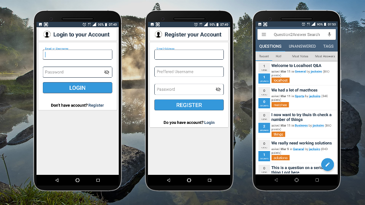
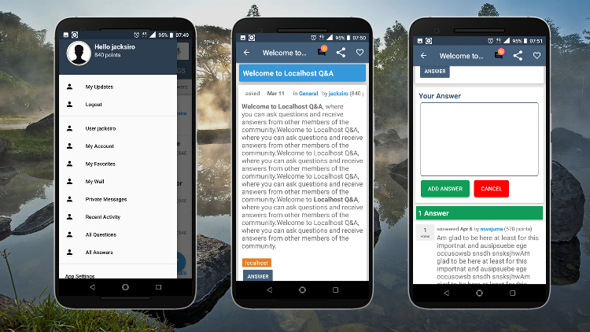

## Introducing Q2Andy!

Q2Andy is a new Android Client for your Question2Answer site which uses a simple custom qa-api to give the same functionality of the web on the app!

### Features
1. User registration
2. User login/logout
3. Accessing Questions/unanswered
4. Asking/Answering questions
5. Blocked users can not access the site from the app.
6. Build using Android Studio (java)

### Demo Links
- [Q2Andy Online](https://appsmata.kenyanexamsrevisions.co.ke/qtoa/)
- [Get it on PlayStore](https://play.google.com/store/apps/details?id=com.appsmata.qtoa)

### Get the source code
Once am done with everything I will be selling it at **$ 35** on **Codester.**

If you want to buy it now outside _Codester_ I give you at **$ 20**

You will get:
- Android Studio full source code
- Qa-Api full source code

### Get in touch
jaksiro[at]gmail.com

We are just getting started
